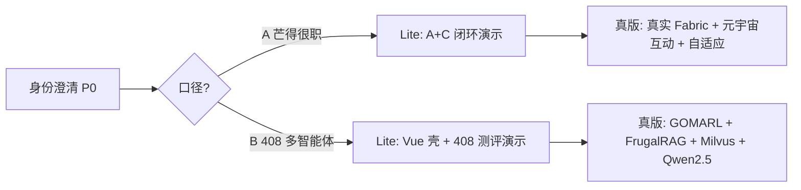

# 产品现状分析报告 · 芒得很职 (Mangdehenzhi)

> 分析视角：产品（许清楚 / Xu）  |  分析日期：2026-07-17  |  代码根：E:\Code\Mangdehenzhi

## ⚠️ 0. 首要结论：产品身份与任务书严重不符（P0 阻塞项）

任务书将本项目定义为「NetLearn（study-help-pro）——面向计算机 408 考研的个性化学习多智能体系统」，架构为 **GOMARL + FrugalRAG + Milvus + Qwen2.5**，双线推进「软件杯 Lite 版 / 大创真版（GOMARL+FrugalRAG+Milvus+Qwen2.5）」。

但通过对代码库（backend/src、frontend/src、docs、deliverables、根目录）的逐项目探查，实际仓库是**另一个产品**：

- **实际产品 = 芒得很职 (Mangdehenzhi)** ——「AI 测评 + 元宇宙 3D 实训 + 区块链证书存证」职业技能培训认证平台。
- **技术栈**：Spring Boot 3.3.5 + Vue 3.5 + TypeScript + Element Plus + Three.js + DeepSeek API + Hyperledger Fabric（占位）+ H2/MySQL。
- **架构对照**：任务书的 GOMARL / FrugalRAG / Milvus / Qwen2.5 **在代码中完全不存在**（仅 `marl_ecdsa_dashboard.html` 出现 "MARL·ECDSA 共识实验台" 字样，是一个独立的实验台可视化 HTML，未接入产品）；408 四科内容（数据结构/计组/OS/计网）**零痕迹**（全局检索确认，package-lock 中的 "408" 为 base64 哈希误命中）。
- 根目录 `后台管理系统/*.java` 为无 `package` 声明的孤儿代码片段（不可编译）；`index/*.js`、`JSMO-PAGE/` 为未接入的散件。

👉 **这是当前最优先需澄清的产品决策**：本仓库到底是（a）放错/标错的仓库，还是（b）「芒得很职」即为大创真版的既成脚手架、需把领域与架构重写成 408+GOMARL+FrugalRAG+Milvus+Qwen2.5？在澄清前，下文以「现状事实」为准描述芒得很职，并对 408 双线目标做适用性与缺口判断。

## 1. 产品定位一句话总结

> 芒得很职是一个面向**职场技能人群**的「学—练—证」一体化平台：用 DeepSeek 做 AI 能力测评、用 Three.js 做 Web 轻量 3D 元宇宙实训、用（拟）区块链存证技能证书——宣称是国内唯一同时覆盖 **A 测评 + B 实训 + C 证书** 的整合叙事平台。

（注：与任务书「408 考研个性化学习多智能体」定位完全不同。）

## 2. 目标用户与核心场景

来自 deliverables/product-strategy 的真实素材（competitive-analysis / roadmap-update）：

| 用户群 | 特征 | 核心痛点 | 平台对应价值 |
|------|------|---------|------------|
| C 端学员（大学生/应届/转行 25–35） | 时间碎片（日 15–20min）、价格敏感 | 完课率低（30–50%）、路径不个性化、证书含金量存疑 | AI 测评 + 个性化推荐 + 证书 |
| 转行在职者（>70%） | 没时间、要见效快 | 学不完、需督学 | 路径 + 督学（未实现） |
| B 端 HR/培训负责人 | 采购看合规/ROI | 招不到可验证技能的人 | 区块链可验证证书（占位） |

核心场景闭环：**测评 → 能力画像 → 学习路径/课程 → 元宇宙实训 → 区块链证书 → 可验证凭证**。（其中「督学」「真实实训互动」「区块链真上链」为关键缺口）

## 3. 功能清单表（现状）

图例：✅ 已实现  🟡 部分/原型  🔲 占位/未接入

| 功能模块 | 现状 | 实现证据 | 所属支柱 | 双线适用性 |
|---------|------|---------|---------|-----------|
| 用户注册/登录/JWT 鉴权 | ✅ 已实现 | AuthController / UserService / JWT | 基础 | 两者均需 |
| 健康检查 / Swagger 文档 | ✅ 已实现 | HealthController / SwaggerConfig | 基础 | 两者均需 |
| AI 能力测评（12题/3维/提交/结果） | ✅ 已实现 | Assessment* + questions.ts | A | 两者均需 |
| AI 测评报告（DeepSeek 真实调用 + 降级） | ✅ 已实现 | AIService / DeepSeekService | A | 两者均需 |
| 课程浏览/详情/分类 | ✅ 已实现 | CourseController / CourseService | A | 两者均需 |
| 测评通过自动签发证书 | ✅ 已实现（DB） | CertificationService | C | 两者均需 |
| 我的证书 / 哈希验证 | ✅ 已实现（DB） | Certifications.vue / verify | C | 两者均需 |
| 区块链上链存证（Fabric） | 🔲 占位 | BlockchainService 仅模拟 txId | C | 真版需（核心差异点未兑现） |
| 元宇宙场景（4类/3D 渲染/会话） | 🟡 原型 | ThreeScene.vue ~372 行、Metaverse* | B | 真版需（演示可砍） |
| 元宇宙 AI 角色实时互动（WebRTC/对话） | 🔲 未实现 | 仅静态场景 + config，无实时后端 | B | 真版需 |
| 个性化课程/学习路径推荐 | 🟡 部分 | RecommendationService（文本建议，非自适应引擎） | A | 两者均需（真版需升级） |
| 课程搜索 | ✅ 已实现 | SearchController | A | Lite 可砍 |
| 管理后台（用户/课程/统计） | ✅ 已实现 | AdminController | 运营 | 真版需 |
| 安全（限流/CORS/安全头/SQL 防护） | ✅ 已实现 | RateLimit / Cors / Security | 基础 | 两者均需 |
| 自动化测试（21+10 用例）/ CI / Docker | ✅ 已实现 | JUnit + Vitest + GH Actions | 工程 | 两者均需 |
| PWA 基础（manifest） | ✅ 已实现 | manifest.json | 体验 | Lite 可选 |
| 督学 / 学习追踪（完课率提升） | 🔲 未实现 | — | A | 真版（路线图 P0） |
| 雇主生态 / HR 对接 / 学分银行 | 🔲 未实现 | — | C | 远期 |
| 企业版 / BI 分析 | 🔲 未实现（仅 admin 计数） | Admin stats | 运营 | 远期 |

散件（未接入主应用）：`index/元宇宙场景交互核心代码.js`、`后台管理系统/*.java`（无 package，不可编译）、`marl_ecdsa_dashboard.html`（独立 MARL 实验台）、`JSMO-PAGE/`（营销页）。

## 4. 软件杯 Lite 版 vs 大创真版：范围差异与优先级

由于仓库实际是「芒得很职」而非「408 考研多智能体」，下列范围建议**分两种口径**，需先由团队负责人确认采用哪一种（见第 5 条）。

### 4.1 口径 A：产品即芒得很职（按任务书双线重解释）
- **软件杯 Lite 版（~20天，跑得起来能演示）**：聚焦「A 测评 + C 证书（模拟链）」闭环 + 基础课程/UI 壳。**可复用现有已实现的 Auth / Assessment / Course / Certification / Metaverse 原型**。元宇宙仅做静态 3D 展示即可；区块链沿用模拟上链以过演示。
- **大创真版（2026-11 中期）**：补齐全 A/B/C —— 真实 Fabric 上链（合规备案前置）、元宇宙 AI 角色实时互动、自适应学习路径引擎、督学、埋点 MCL。与 deliverables 路线图一致。

### 4.2 口径 B：必须改成 408 考研多智能体（严格按任务书）
- 当前仓库**不能作为 408 真版基础**——领域（职场技能 vs 408 四科）、架构（Spring+Vue+DeepSeek vs GOMARL+FrugalRAG+Milvus+Qwen2.5）、智能体协作（无）全部不匹配。
- **Lite 版**：可在现有 Vue 壳 + DeepSeek 上快速套一层「408 知识点测评 + 答疑（FrugalRAG 占位）」演示；但多智能体（GOMARL 共识）与 Milvus 向量库需新搭。
- **真版**：需重构——引入多智能体编排（GOMARL 共识）、FrugalRAG 检索增强（Milvus 向量库）、Qwen2.5 替代 DeepSeek、408 四科知识库；元宇宙模块可能需舍弃或保留为演示彩蛋。

### 4.3 优先级建议（通用）
1. **P0 先解身份问题**（见第 5 条）——否则 Lite/真版都无从排期。
2. **P0 Lite 可演示闭环**：登录 → 测评 → AI 报告 → 课程/路径 → 证书（模拟链）。现有代码已 ~80% 具备。
3. **P1 真版差异化**：区块链真上链（合规前置）、元宇宙实时互动、自适应路径/督学。
4. **P2 生态**：雇主/HR 对接、企业 BI。

## 5. 待确认的产品问题（产品层面矛盾）

1. **【阻塞】产品身份冲突**：仓库是「芒得很职（职业技能）」，任务书是「NetLearn（408 考研多智能体）」。二者定位、用户、架构全异。需明确：仓库是否放错？还是芒得很职即大创真版、需重写为 408+GOMARL/FrugalRAG/Milvus/Qwen2.5？
2. **核心差异点未兑现**：区块链证书对外宣称是「核心差异点/国内第一平台」，但代码中仅 `BlockchainService` 模拟上链（生成假 txId），无真实 Fabric 网络。竞品分析文档已注明「不得对外表述为已上线」——存在**对外宣传与实现不符**风险。
3. **「元宇宙 AI 角色实时互动」名实不符**：README/文档称「AI 角色实时互动」，实际仅 ThreeScene 静态 3D + 场景配置，无 WebRTC/对话后端；与 Mursion 类竞品差距大。
4. **「个性化学习路径」≠ 自适应引擎**：当前 `RecommendationService` 仅基于最近一次测评结果用 AI 生成文本建议，无学习追踪、无动态调整、无督学——而路线图把「个性化路径 + 督学」列为 Q3 P0 且承诺 +15~20pp 完课率，**承诺能力未落地**。
5. **双线目标在仓库中无任何对应分支/里程碑/标签**：无法从代码判断是否已有 Lite 切片；需产品侧明确 Lite 的「最小可演示功能集」定义。
6. **散件与主线脱节**：`后台管理系统/*.java`（无 package）、`index/*.js`、`marl_ecdsa_dashboard.html` 未纳入主工程，易误导后续开发者以为「区块链/元宇宙已完整」。建议清理或明示为实验品。
7. **数据/内容薄弱**：种子课程与测评题量极小（12 题通用职业测评），无 408/学科内容；若走 408 口径需重建知识库与题库。
8. **指标与埋点缺失**：路线图定义北极星 MCL 与 AARRR 埋点（P0 测评完成/闭环完成），但代码中**无埋点实现**——「功能上了数不清」风险仍在。

## 6. 建议的下一步产品侧工作（按优先级）

| 优先级 | 动作 | 产出/验证 | 负责 |
|------|------|----------|------|
| **P0** | 与用户/导师澄清产品身份（芒得很职 vs 408 多智能体）并锁定口径 A/B | 一份《产品定位确认书》 | 产品 + 负责人 |
| **P0** | 定义「软件杯 Lite 最小可演示功能集」清单（基于现有已实现模块裁剪） | Lite PRD / 验收清单 | 产品 |
| **P0** | 校正对外措辞：区块链/元宇宙实时互动/自适应路径 在兑现前不得写入演示稿/申报书 | 措辞清单 | 产品 |
| **P1** | 若口径 A：排期真实 Fabric 上链 + 网信办备案前置；若口径 B：输出 408 架构 PRD（GOMARL/FrugalRAG/Milvus/Qwen2.5） | 真版 PRD | 产品 + 架构 |
| **P1** | 落地 MCL / AARRR 埋点（P0：测评完成、闭环完成）作为度量地基 | 埋点规范 | 产品 + 数据 |
| **P2** | 自适应学习路径 + 轻量督学设计（对齐 +15~20pp 完课率承诺） | 路径/督学 PRD | 产品 |
| **P2** | 清理散件（后台管理系统/index/marl 仪表盘）或迁入实验区并标注 | 仓库整洁度 | 工程 |
| **P2** | 内容/题库扩充或 408 知识库建设（依口径） | 内容清单 | 产品 + 内容 |
