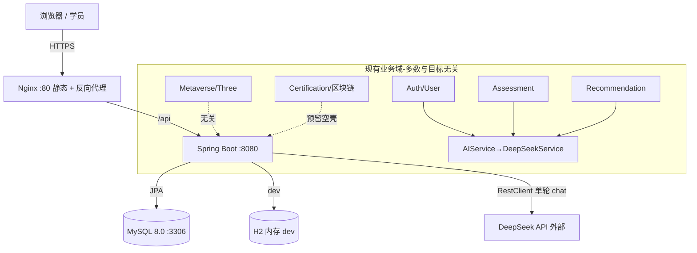
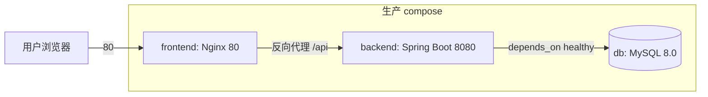

# NetLearn（study-help-pro）· 《架构现状分析报告》

> 架构师：高见远（Gao / software-architect）
> 分析对象：`E:\Code\Mangdehenzhi`（实际名称为「芒得很职 Mangdehenzhi」）
> 分析日期：基于仓库快照（README / docker-compose / Makefile / 源码 / deliverables 文档）
> 方法论：定向探查（docker-compose、Makefile、pom.xml、application.yml、关键源码、*.java/*.ts/*.html），未全量读取前端 node_modules（8000+ 文件）

---

## 0. 一句话结论（最重要）

**当前代码库是一个「AI + 元宇宙 + 区块链」职业技能培训认证平台（芒得很职），与目标架构（408 考研个性化学习多智能体系统 GOMARL + FrugalRAG + 408 四科 + Milvus + Qwen2.5）在「业务领域」上几乎零重叠。**

现有代码对目标架构的**唯一复用价值是「通用脚手架」**（Spring Boot API 骨架、Vue SPA 骨架、MySQL、Docker 编排、JWT 鉴权、CI）。所有领域代码（职业测评/元宇宙/区块链证书/营销页）要么需下线、要么需彻底重写为 408 学习领域。「代码迁就文档」策略成立的前提是：**把大创申报书的 GOMARL+FrugalRAG+408+Milvus+Qwen2.5 作为单一事实源，现有领域实现视为可丢弃/参考，而非迁就对象。**

经 `backend/src` 全量关键词检索（Milvus / Qwen / 408 / Agent / MARL / RAG / vector / Embedding / langchain / consensus / 强化）**命中 0 个源文件**；`pom.xml` 无任何 Agent / RAG / 向量库依赖。结论：**GOMARL、FrugalRAG、Milvus、Qwen2.5、408 四科内容，当前实现度均为 0%**（仅有一个未集成的 MARL 静态可视化原型 `marl_ecdsa_dashboard.html`）。

---

## 1. 技术栈总览表

| 层 | 组件 | 版本 / 说明 | 与目标关联 |
|---|---|---|---|
| 前端框架 | Vue 3 + Vite + TypeScript | 3.5 / 6 / 5 | 可复用脚手架 |
| 前端 UI | Element Plus + Pinia + Vue Router + Axios | 2.9 / 2.3 / 4 / 1.7 | 可复用 |
| 前端 3D | Three.js | 0.170 | **与目标无关（元宇宙），建议下线** |
| 前端测试 | Vitest + jsdom | 2.1 / 25 | 可复用 |
| 后端语言/框架 | Java 17 + Spring Boot | 3.3.5 | 可复用脚手架 |
| 后端安全 | Spring Security + JWT（jjwt 0.12.6） | — | 可复用，但默认密钥/口令高危 |
| 后端持久化 | Spring Data JPA + MySQL 8 / H2 | — | 关系库可复用；**无向量库** |
| 后端 AI 调用 | `RestClient` 直连 DeepSeek API | deepseek-chat | **与目标背离（应换 Qwen2.5）** |
| 后端文档/工具 | SpringDoc 2.6 / Hutool 5.8 / Lombok | — | 可复用 |
| 向量库 | **Milvus** | **未接入** | 目标核心缺口 P0 |
| 大模型 | DeepSeek（硬编码） | — | 目标要求 Qwen2.5 |
| 多智能体 | 无框架 / 无编排 | — | 目标 GOMARL 缺口 P0 |
| RAG | 无 | — | 目标 FrugalRAG 缺口 P0 |
| 编排/部署 | Docker + docker-compose + Nginx + Makefile + GitHub Actions | — | 可复用，需增补向量库/智能体服务 |
| 其他遗留产物 | JSMO-PAGE（营销页）、`后台管理系统/`（Java 参考片段，未编译）、`index/`（Three.js 片段）、`marl_ecdsa_dashboard.html`（MARL 研究原型） | — | 参考/研究，非运行系统 |

> 前端源码实际仅约 **28 个文件**（components/views/router/stores/api/data），8000+ 文件绝大多数为 `node_modules`；不必全读。

---

## 2. 系统模块图

### 2.1 当前目录结构（已清理展示）

```
Mangdehenzhi/
├── docker-compose.yml          # 生产编排：db + backend + frontend
├── docker-compose.dev.yml      # 开发编排（热重载）
├── Makefile                    # 统一开发命令入口
├── README.md                   # ⚠️ 描述的是「芒得很职」区块链/元宇宙平台（与目标不符）
├── .env.example                # DEEPSEEK_API_KEY / JWT_SECRET / MySQL
├── marl_ecdsa_dashboard.html   # ⚠️ 独立 MARL+ECDSA 研究仪表盘（未集成，零依赖静态页）
│
├── backend/                    # Spring Boot（包名 com.mangdehenzhi）
│   ├── pom.xml                 # 仅 Spring 全家桶 + JWT + Hutool（无 Agent/RAG/向量库）
│   ├── sql/init.sql            # users/courses/assessments/certifications/metaverse_sessions...
│   └── src/main/java/com/mangdehenzhi/
│       ├── ai/                 # AnalysisReport.java, RecommendationResult.java（仅 DTO）
│       ├── blockchain/         # ⚠️ 预留空壳（零业务代码）
│       ├── config/             # Security/JWT/CORS/限流/日志/Swagger
│       ├── controller/         # 10 个：Admin/Assessment/Auth/Certification/Course/
│       │                       #     Health/Metaverse/Recommendation/Search/User
│       ├── entity/             # User/Course/Assessment/AssessmentResult/Certification/MetaverseSession
│       ├── service/            # AIService, DeepSeekService, ...（impl 子包为空）
│       ├── metaverse/          # 元宇宙场景配置（与目标无关）
│       └── repository/dto/enums/exception/
│
├── frontend/                   # Vue 3 SPA（vite + element-plus + three）
│   └── src/
│       ├── views/              # Home/Login/Register/Dashboard/Courses/CourseDetail/
│       │                       # Assessment*/Certifications/Metaverse/NotFound
│       ├── components/         # AppHeader/NavBar/SkeletonCard/ThreeScene
│       ├── data/questions.ts   # ⚠️ 职业技能测评题库（沟通/协作…非 408）
│       ├── stores/user.ts router/ api/ types/
│
├── 后台管理系统/                # ⚠️ 两个 .java 参考片段，包名非 com.mangdehenzhi，未编译
├── index/                      # ⚠️ 独立 Three.js 元宇宙交互片段
├── JSMO-PAGE/                  # ⚠️ 营销页构建器导出资源（UePage lib / PageText.jsmo）
└── deliverables/               # SECURITY_AUDIT_REPORT.md / product-strategy / gstack
```

### 2.2 模块关系（Mermaid）



---

## 3. 服务 / 部署拓扑（基于 docker-compose）



| 服务 | 镜像 | 端口 | 依赖 | 备注 |
|---|---|---|---|---|
| `db` | mysql:8.0 | 3306 | — | 持久卷 `mysql_data`；无向量库 |
| `backend` | 自建 Spring Boot | 8080 | `db`(healthy) | 注入 `DEEPSEEK_API_KEY`/`JWT_SECRET`/`MYSQL_*` |
| `frontend` | 自建 Nginx | 80 | `backend` | 构建产物静态托管 + 反向代理 |

- 开发变体：`db` + `backend-dev`（maven:3.9 + 热重载 8080）+ `frontend-dev`（node:20 + Vite HMR 5173）。
- **目标架构缺口**：拓扑中**没有** Milvus 服务、没有 Python/智能体服务、没有模型推理服务。目标拓扑需扩展为：`db(MySQL) + milvus(向量) + backend(编排/API) + agent-service(多智能体/GOMARL) + llm-proxy(Qwen2.5) + frontend`。

---

## 4. 多智能体（GOMARL / FrugalRAG）现状与缺口

### 4.1 GOMARL（多智能体共识 / 强化学习）—— 实现度 0%

- **运行系统中无任何多智能体代码**。`backend/src` 检索 Agent/MARL/consensus/强化 均为 0 命中；无 Agent 框架、无角色定义、无消息协议、无共识/RL 算法、无状态管理。
- **唯一痕迹**：根目录 `marl_ecdsa_dashboard.html` —— 一个**零依赖静态 HTML**（内联 CSS/JS、内联 SVG、离线可跑）的「MARL·ECDSA 共识实验台 · 训练仪表盘」。它包含：总览 / 模式对比 / 训练曲线 / 延迟吞吐 / 上链可视化 / 参数配置 6 个 section，并显式标注「样本量 n=3 · 数据缺失」「selfish 分区」等。
  - 性质判断：**研究/实验可视化原型**，不是工程实现；且 ECDSA 指向区块链上链叙事，与目标 408 学习的 GOMARL 概念相近但**未集成、无算法、无数据通路**。属于「概念种子」，不能算实现。
- 结论：GOMARL 需要从零设计最小可运行智能体协议并工程化。

### 4.2 FrugalRAG（精简检索增强生成）—— 实现度 0%

- 无 RAG、无检索器、无语料库、无 Embedding、无上下文压缩/重排。
- 当前 AI 用法：`AIService.analyzeAssessmentResult / generateRecommendations` → `DeepSeekService.callDeepSeek` 一次同步 `chat/completions` 调用，硬编码 system/user prompt + JSON 解析，无工具调用、无记忆、无知识检索。
- 结论：FrugalRAG 需从语料建设 → Embedding → 向量检索 → 上下文压缩 → 提示组装 全链路新建。

### 4.3 大模型 Qwen2.5 —— 实现度 0%

- 仅 DeepSeek（`deepseek-chat`，`https://api.deepseek.com/v1/chat/completions`），URL/model/key 硬编码在 `DeepSeekService`，无模型抽象/注册/降级层，无法低成本的切换/并置 Qwen2.5 或本地模型。

### 4.4 向量库 Milvus —— 实现度 0%

- compose 无 Milvus 服务；`pom.xml` 无 Milvus/向量客户端；`init.sql` 仅有关系表；无 Embedding 管线。

### 4.5 408 四科内容 —— 实现度 0%

- 前端 `data/questions.ts` 是**职业技能测评题库**（沟通/协作/问题解决等维度），非 408。
- 实体与表为：User/Course/Assessment/AssessmentResult/Certification/MetaverseSession；**无 Subject/Chapter/KnowledgePoint/QuestionBank/真题** 等 408 知识模型。

---

## 5. 目标架构 vs 现状 差距清单

| 组件 | 目标（大创申报书） | 现状 | 缺口 | 优先级 |
|---|---|---|---|---|
| 多智能体 GOMARL | 多智能体共识/强化学习编排，角色化协作 | 仅 `marl_ecdsa_dashboard.html` 静态可视化原型（未集成、含 ECDSA 区块链叙事） | 智能体角色定义、消息/共识协议、RL/协调器、状态管理、可运行闭环 | **P0** |
| RAG FrugalRAG | 精简检索增强生成（上下文压缩/重排） | 无 | 语料库、Embedding、向量检索、压缩/重排、提示组装 | **P0** |
| 向量库 Milvus | 408 知识向量存储与检索 | 无（仅 MySQL 关系库） | Milvus 服务、客户端、集合/索引 schema、嵌入管线 | **P0** |
| 大模型 Qwen2.5 | 以 Qwen2.5 为主模型 | 仅 DeepSeek 硬编码直连 | LLM 抽象层/注册表、Qwen2.5 provider、本地/API 切换、降级 | **P0** |
| 408 内容体系 | 数据/计组/OS/计网 四科知识图谱+题库+真题 | 职业技能测评题库（沟通/协作…） | 四科知识结构、知识点图谱、历年真题、难度/题型标注、种子数据 | **P0/P1** |
| 个性化学习编排 | 基于多智能体共识的动态学习路径与学情画像 | 单轮 LLM 模板化推荐（mock 降级） | agent 驱动的薄弱诊断、动态路径、学情画像 | **P1** |
| 前端领域层 | 408 学习/刷题/智能体对话界面 | 测评/课程/元宇宙/证书（Vue） | 重构为考研学习台；下线元宇宙(Three.js)/区块链证书/营销页 | **P1** |
| 部署拓扑 | 含 Milvus + Agent 服务 + Qwen 推理服务 | 3 服务（MySQL+Backend+Frontend） | 新增向量库与智能体/模型服务编排、资源/GPU 规划 | **P1** |
| 安全基线 | 生产级鉴权/密钥管理 | D 级（3 Critical：提交密钥/默认口令/未授权写） | fail-fast 密钥、移除默认口令、收紧授权 | **P0（重构必带）** |

---

## 6. 关键架构风险（6 条）

- **R1（战略/范围，最高）领域彻底错位**：现有领域（职业测评/元宇宙/区块链）与 408 多智能体零重叠，除脚手架外几乎全部需重写。「代码迁就文档」的正确执行方式是**以目标架构为单一事实源**，避免被旧实现绑架；应明确标注每个旧模块「保留脚手架 / 重写 / 下线」。
- **R2（安全，Critical）默认凭据与未授权写**：安全审计评级 **D（26 项：3 Critical/5 High）**——提交的 JWT 对称密钥（`mangdehenzhi-jwt-secret-key-2026...`）、默认口令 `admin/admin123`、课程创建接口 `permitAll()` 可匿名写。重构时务必 fail-fast 缺密钥、移除生产种子弱口令、收紧授权，否则演示即被攻破。
- **R3（LLM 耦合）DeepSeek 硬编码、无智能体循环**：`DeepSeekService` 把 URL/model/key 写死，无模型抽象、无工具调用、无记忆；接入 Qwen2.5 与切本地模型成本高，且当前「智能体」只是单轮 HTTP 调用。
- **R4（数据/内容，最大工作量）408 知识建模空白且不确定性强**：四科知识图谱、真题、难度标注、检索语料是最大工作量与最大不确定性来源；必须与 Milvus + Embedding + 语料建设并行启动，否则 RAG 与个性化学习无米下锅。
- **R5（技术不确定性）GOMARL/FrugalRAG 均为研究级概念**：缺工程实现与可运行原型；`marl_ecdsa_dashboard` 仅可视化无算法。需先定义最小可运行智能体协议（角色/消息/共识）再谈系统集成，避免空中楼阁。
- **R6（部署/运维）目标拓扑需新增有状态/算力服务**：当前 compose 无向量库/智能体/模型服务占位；Milvus（有状态）、Python 智能体服务（可能与 Spring 并存或独立）、Qwen 推理（可能需 GPU）都需提前规划。**软件杯 20 天 Lite 版**必须在「精简栈」上跑通（Milvus 可降级为内存向量/本地轻量、智能体单进程编排、Qwen 走 API）。

---

## 7. 建议的下一步架构 / 重构任务（按优先级，呼应「代码迁就文档」）

**P0 —— 先立骨架、对齐目标、封死安全**
- **A1 目标架构蓝图（SDD/ADR）**：以 GOMARL+FrugalRAG+408 四科+Milvus+Qwen2.5 为单一事实源，输出目标模块图、服务拓扑、智能体协议、数据模型；对旧代码逐模块标注「保留脚手架 / 重写 / 下线」。
- **A2 脚手架复用 + 领域冻结**：保留 Spring Boot（Security/JWT/JPA/CI/Docker）与 Vue+Vite+Pinia+Router 骨架；将 `后台管理系统/`、`JSMO-PAGE/`、`index/`、`marl_ecdsa_dashboard.html` 移入 `research/` 或 `docs/`（参考/研究，移出构建路径）；下线 Three.js 元宇宙与区块链证书模块。
- **A3 模型抽象层 + Qwen2.5 接入**：定义 `LLMProvider` 接口（complete/stream/embed），保留 DeepSeek 为 provider 之一，新增 Qwen2.5 provider，解耦 `AIService` 硬编码。
- **A4 408 内容体系建模**：设计 `Subject→Chapter→KnowledgePoint→Question`（难度/年份/题型/真题来源），建表与种子数据（先数据结构/计组起步）。
- **A5 安全基线重建**：移除提交密钥与默认口令、fail-fast 缺密钥、收紧 `SecurityConfig` 授权。
- **A6 软件杯 Lite 版「精简可跑通」栈**：20 天内以可演示闭环为目标——Milvus 降级为内存向量/本地轻量、智能体单进程编排、Qwen 走 API。

**P1 —— 核心能力工程化**
- **A7 FrugalRAG + Milvus**：引入 Milvus 服务与客户端；实现 Embedding（接 Qwen/开源）→ 索引 → 精简检索（上下文压缩/重排）；以四科知识点+真题为首批语料。
- **A8 GOMARL 最小可运行闭环**：定义智能体角色（学情诊断/路径规划/答疑/出题/评估）、消息协议、共识/RL 协调器；先以「规则 + LLM」轻量版跑通闭环，再迭代强化学习。

**P2 —— 体验与规模化**
- **A9 前端重构为 408 学习台**：学习/刷题/智能体对话界面，替换现有测评/课程/元宇宙/证书视图；保留 Pinia/Router/API 骨架。

---

## 8. 给团队的特别提示

1. **README 与 deliverables 的策略文档（roadmap-update / competitive-analysis）描述的全是「芒得很职」区块链/元宇宙愿景，与目标 408 多智能体完全无关**。不要被这些文档误导为「现状目标」——它们反映的是旧方向，新的事实源是大创申报书（GOMARL+FrugalRAG+408+Milvus+Qwen2.5）。
2. `marl_ecdsa_dashboard.html` 是目前唯一与「多智能体」沾边的产物，但它是**区块链共识(MARL+ECDSA)的研究可视化**，不是 408 学习智能体；其「共识/自私分区/上链」思路可作 GOMARL 概念参考，但需剥离区块链叙事、重建为学习域智能体。
3. 建议将本报告与 A1（目标架构蓝图）作为「代码迁就文档」的总起点，避免工程师在旧领域代码上「小修小补」而偏离大创架构。
