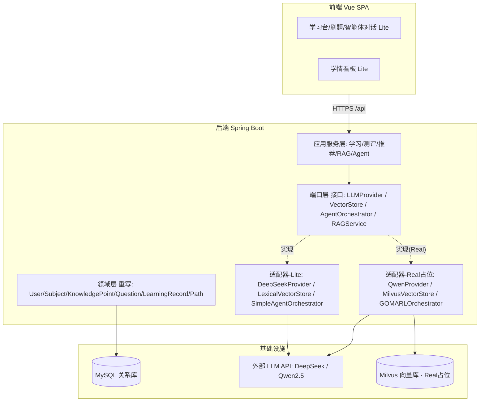
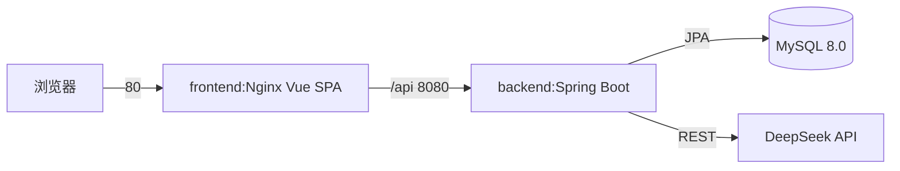
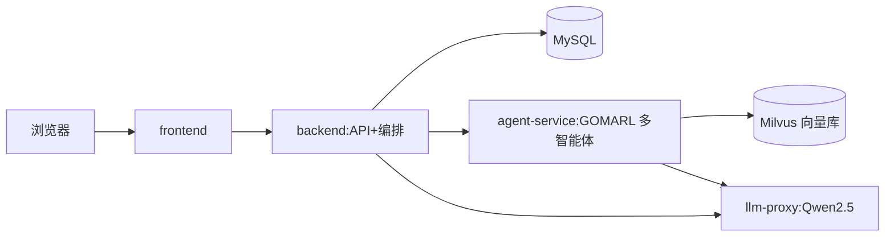
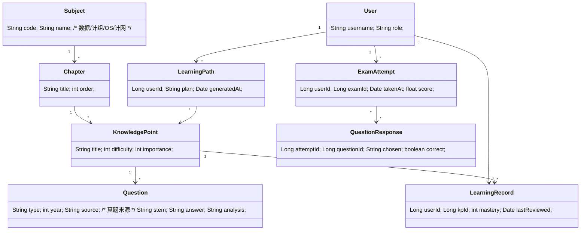

# ⚠️ 已作废（VOID）—— 本文件不再作为事实源

> **作废原因**：team-lead 于 2026-07 确认**保留芒得很职（vocational），不走 408 重写**。本 408 多智能体 SDD 全部作废。
> **现行架构事实源**：见 **`docs/sdd-mangdehenzhi-vocational.md`**（芒得很职 目标架构 SDD · 口径 A）。

---

# NetLearn 目标架构蓝图（SDD · 骨架草稿 v0.2）【已作废】

> 文档定位：**后续重构的单一事实源（Single Source of Truth）**
> 版本：v0.2（骨架草稿；v0.1 基础上吸收工程师 A/B 逐文件核实 + 敲定 Lite 向量策略）
> 架构师：高见远（software-architect）
> 策略锚点：**代码迁就文档**——以目标架构（GOMARL+FrugalRAG+408 四科+Milvus+Qwen2.5）为准，现有「芒得很职」代码仅作脚手架复用。
> 分期：Lite（软件杯 ~20 天，可跑通优先） / Real（大创 2026.11，叠加完整能力）

---

## 0. 范围与本次边界

本版为**骨架草稿**，只定：
- 目标模块划分与依赖方向
- 服务/部署拓扑（Lite 落地，Real 占位）
- 端口接口（Ports）签名
- 智能体协议草案（占位级）
- 408 数据模型骨架 + 现有表处置策略
- 安全基线单列节 + 遗留代码拆除原子任务

**不在本版铺满**：完整 API 契约、算法细节、RAG 重排策略、GOMARL 共识/RL 具体实现、性能预算、各模块工作量排期。这些待 PM PRD（需求边界）与 team-lead 合成全景图后补齐至 v1.0。

**v0.2 增量（来自工程师 A/B 核实）**：① §4.2 `VectorStore` 增加 `LEXICAL/DENSE` mode（解决 Lite 无 embedding 来源缺口）；② §6.1 现有表处置策略（复用/改造/删除/替换）；③ §9 遗留代码拆除原子任务；④ §10 待补输入更新（工程师输入已收，待 PM PRD）。

---

## 1. 设计原则

1. **端口-适配器（Ports & Adapters）**：`LLMProvider` / `VectorStore` / `AgentOrchestrator` 等端口接口**现在定死**，Lite 用轻量实现、Real 换重实现，业务层零改动。
2. **代码迁就文档**：目标架构是唯一事实源；旧领域代码（职业测评/元宇宙/区块链/营销）视为可重写/可下线参考。
3. **分期不回改**：Lite 上线部分在 Real 阶段作为增量叠加，而非重写。
4. **可插拔 AI**：DeepSeek 作 Lite 默认 provider，Qwen2.5 作 Real 主模型，统一 `LLMProvider` 抽象。
5. **Lite 零额外依赖优先**：向量检索 Lite 走关键词（无 embed、无第二 API Key），避免演示因外部 embedding 不可用而崩。

---

## 2. 目标模块图（Lite 优先，Real 占位）



> Lite 阶段只启用 `ADAPT_L`（关键词向量、单 agent、DeepSeek）。`ADAPT_R` 与 `MILVUS` 为占位，不进入 Lite 构建。

---

## 3. 服务 / 部署拓扑

### 3.1 Lite 拓扑（~20 天，立即落地）

3 服务（复用现有 docker-compose 结构）：`db` + `backend` + `frontend`。**无 Milvus、无独立 agent/llm 服务**（多智能体与 RAG 在 backend 进程内以桩运行）。

### 3.2 Real 拓扑（大创，分期叠加，本版仅占位）

新增 `milvus`、`agent-service`、`llm-proxy` 三服务；Lite 的 `LexicalVectorStore`/`SimpleAgentOrchestrator` 替换为指向这些服务的适配器实现。

---

## 4. 端口接口定义（Ports — 现在定死）

> 以 Java 接口示意；Lite 提供轻量实现，Real 提供重实现。业务/应用层只依赖接口。

### 4.1 LLMProvider（AI 模型可插拔核心）
```java
public interface LLMProvider {
    String complete(String systemPrompt, String userPrompt, GenOptions opts); // Lite/Real 共用
    default java.util.stream.Stream<String> stream(String system, String user, GenOptions o)
        { throw new UnsupportedOperationException(); }            // Real 可选
    default float[][] embed(List<String> texts)                  // Real 专用（见 4.2 说明）
        { throw new UnsupportedOperationException(); }
}
// Lite 实现: DeepSeekProvider (RestClient 调 deepseek-chat, 无 Key 降级本地 mock；无 embed)
// Real 实现: QwenProvider   (调 Qwen2.5, 支持 embed)
```
> ⚠️ **embed 可用性**：DeepSeek 为 chat 模型**不提供 embedding**。故 `embed` 在 Lite 默认不实现（抛 UOE）；仅 Real 的 QwenProvider 实现。这直接驱动 §4.2 的 `LEXICAL` 默认决策。

### 4.2 VectorStore（检索底座，Lite 不引 Milvus）
```java
public interface VectorStore {
    enum Mode { LEXICAL, DENSE }                 // Lite=LEXICAL, Real=DENSE
    void upsert(String collection, String id, float[] vector, Map<String,Object> payload);
    List<Hit> search(String collection, String query, float[] queryVector, int topK, Filter filter);
}
// Lite 实现: LexicalVectorStore (BM25/关键词；零 embed、零额外 API Key；小批量 408 语料够演示)
// Real 实现: MilvusVectorStore  (DENSE；接 Milvus 集合/索引/过滤，queryVector 由 Qwen embed 生成)
```
> **Lite embed 缺口（已决）**：由于 Lite 默认 DeepSeek 无 embedding，纯 `DENSE` 检索会"空转"。故 **Lite 默认 `Mode.LEXICAL`**（关键词/BM25，无向量、无第二 Key），对小批量 408 知识点/真题语料检索效果足够稳；Real 切 `DENSE` + Milvus。
> **备选兜底**：若 Lite 想"看起来像语义检索"，可让 `AgentOrchestrator` 用"候选知识点塞进 prompt 让 LLM 选"的检索式 prompt（零向量库、零 embed），但受上下文长度限制，仅适合题量小。

### 4.3 AgentOrchestrator（多智能体编排，Lite 最小桩）
```java
public interface AgentOrchestrator {
    AgentResponse handle(Query query, SessionContext ctx);
}
// Lite 实现: SimpleAgentOrchestrator (单 agent 直答 + 占位多 agent 路由日志)
// Real 实现: GOMARLOrchestrator     (多角色智能体 + 共识/强化学习协调)
```

### 4.4 RAGService（FrugalRAG 组合端口）
```java
public interface RAGService {
    RAGAnswer answer(String question, Long userId);
}
// Lite 实现: LexicalVectorStore 检索 + 单轮 LLM 生成 (最小可见 RAG 桩)
// Real 实现: FrugalRAG (DENSE 检索→上下文压缩→重排→生成)
```

---

## 5. 智能体协议草案（GOMARL 占位级）

**角色（Lite 单 agent 承载，Real 多角色拆分）**
| 角色 | 职责 | Lite | Real |
|---|---|---|---|
| 学情诊断 Agent | 薄弱点/能力画像 | 直答桩 | GOMARL 节点 |
| 路径规划 Agent | 动态学习路径 | 直答桩 | GOMARL 节点 |
| 答疑 Agent | 知识点讲解 | 直答桩 | GOMARL 节点 |
| 出题 Agent | 针对性练习 | 直答桩 | GOMARL 节点 |
| 评估 Agent | 效果度量 | 直答桩 | GOMARL 节点 |

**消息信封（草案）**
```
AgentMessage {
  messageId, sessionId, fromAgent, toAgent,
  role,              // 上表角色
  payload,           // 结构化内容
  timestamp
}
```
**协调语义**：Lite = 单 agent 直接返回（路由桩仅打日志）；Real = GOMARL 多 agent 消息交换 + 共识/RL 收敛后返回。具体共识算法与奖励函数本版不展开。

---

## 6. 408 数据模型（骨架）


> Lite 起步种子：**数据结构、计算机组成**两科；Real 补全四科 + 真题 + 知识点图谱。

### 6.1 现有表处置策略（来自工程师核实：6 张业务表与 init.sql 完全一致，无漂移）
- **复用**：`users`（认证/用户，必留）。
- **改造复用**：`courses`（作四科粗粒度目录 / 映射 Subject）、`assessments` + `assessment_results`（改造成练习/模考 + 作答记录）。
- **删除/替换**：
  - `certifications`（与 Lite 考研无关；区块链存证本就注释态）→ 随区块链包处理。
  - `metaverse_sessions`（随 metaverse 包删，见 §9）。
  - `assessment_dimensions` / `assessment_dimension_scores` + `AssessmentResult.dimensionScores`(Map) 为**职业技能"维度得分"模型**，408 需按知识点/题得分 → 替换为 `Question` / `ExamAttempt` / `QuestionResponse` 结果模型，**勿硬套 dimension**。
- **prod 风险**：`application-prod.yml` 用 `ddl-auto: validate` 且 init.sql 挂 `docker-entrypoint-initdb.d`，MySQL 首启先执行 init.sql 再 JPA validate → 一致故可过；**任何实体改动须同步 init.sql，否则 prod 启动即挂**。Lite(H2 `create-drop`) 无此限制，但设计新表时即同步维护 init.sql。

---

## 7. 安全基线（对应 QA P0）

> 依据既有安全审计（D 级，3 Critical）。重构必带，单列以对齐 QA。

| 项 | 现状（高危） | SDD 要求 |
|---|---|---|
| JWT 密钥 | `application.yml` 硬编码默认字符串 + compose 默认注入 | 移除默认值；env/`JWT_SECRET` 注入；**prod 缺失则 fail-fast 启动失败** |
| 默认口令 | `DataInitializer` 写死 admin/admin123 等弱口令 | 仅 `dev` Profile 种子；生产随机生成+强制首次改密；源码不留默认口令 |
| 匿名写 | `SecurityConfig` `/api/courses/**` 等 `permitAll()` | 收紧为需认证；移除一切匿名写接口 |
| 密钥管理 | `.env.example` 入库、target 含密钥 | 密钥经密钥管理器/部署机密注入，不入库；`.env` 已被 gitignore（保持） |

对应 QA P0：上述三项 Critical（F-001 提交密钥 / F-002 默认口令 / F-003 未授权写）须在上线前清零。

---

## 8. 分期映射速查

| 能力 | Lite（~20 天） | Real（大创，叠加） |
|---|---|---|
| LLM | DeepSeekProvider（无 embed） | + QwenProvider（主模型，含 embed） |
| 向量 | LexicalVectorStore（LEXICAL，无 Milvus） | + MilvusVectorStore（DENSE） |
| RAG | 最小桩（关键词检索+单轮生成） | + FrugalRAG（压缩/重排） |
| 智能体 | SimpleAgentOrchestrator（单 agent 桩） | + GOMARLOrchestrator（多 agent 共识/RL） |
| 408 内容 | 数据结构/计组种子 + 基础题库 | 四科全 + 真题 + 知识点图谱 |
| 部署 | 3 服务（MySQL+Backend+Frontend） | + Milvus + agent-service + llm-proxy |

---

## 9. 遗留代码拆除（原子任务，来自工程师逐文件核实）

| 目标 | 范围 | 风险 | 处置 |
|---|---|---|---|
| 孤儿目录迁移 | `index/` `JSMO-PAGE/` `marl_ecdsa_dashboard.html` `后台管理系统/` | 零构建影响（无任何 Dockerfile/compose/vite/pom 引用；`后台管理系统/` 为从不参与 Maven 构建的孤立失败代码） | **已授权工程师立即迁移至 `research/`** |
| blockchain 包 | `blockchain/`（BlockchainService+CertificationContract，纯死代码，仅注释引用；字段根本不存在） | 零编译影响；`Certification.blockchainTxId` 为普通列不依赖该包 | 纳入"领域拆除"原子任务，与 certifications 表/证书模块一并下线（勿零散删） |
| metaverse 包 | 后端 `Metaverse*` + 前端 6 处（api/router/views/Metaverse.vue/NavBar/types/test）+ `metaverse_sessions` 表 | 前后端耦合，漏改任一处即 404/编译错 | **受控原子任务**：前后端+DB 一次性清理，列为 refactor 阶段任务，勿顺手删 |
| DataInitializer 种子 | 现 seed 职业技能 courses/assessments | 408 改造必须替换为 408 数据 | 重写种子为 408 起步数据（数据结构/计组） |

> 核实佐证：全仓 grep `BlockchainService|storeOnChain|verifyOnChain` 仅自身文件 + `CertificationService.java` 注释行（引用字段不存在）；grep `JSMO-PAGE|marl_ecdsa|/index/|元宇宙场景交互|后台管理系统` 仅在 `.md` 文档与孤儿 java 自身命中，无任何 build/config 引用。

---

## 10. 待补输入（吸收后细化 SDD）

- ✅ **工程师 A/B 核实已收**：实体↔init.sql 一致、可删除性确认、向量 `LEXICAL/DENSE` 决策；C 工作量粗估待本 SDD 端口/数据模型定稿后由工程师给出。
- **PM PRD**（待 team-lead 汇总）：需求边界、用户故事、验收标准 → 补全 API 契约与模块粒度。
- **QA 安全细则**（待）：F-001~F-003 及 High 项修复验收口径。

> 本骨架即「代码迁就文档」起点：接口已定，实现后补；领域重写，脚手架复用。待 PM PRD 到齐 + team-lead 合成全景图后，升 v1.0 完整 SDD。
