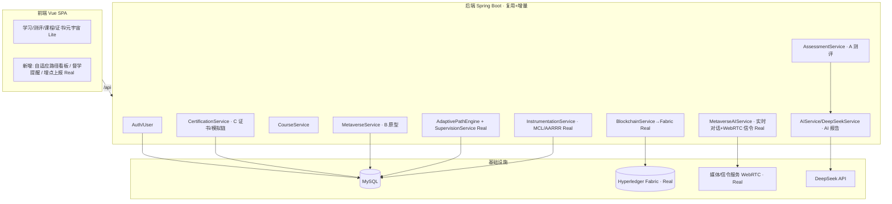
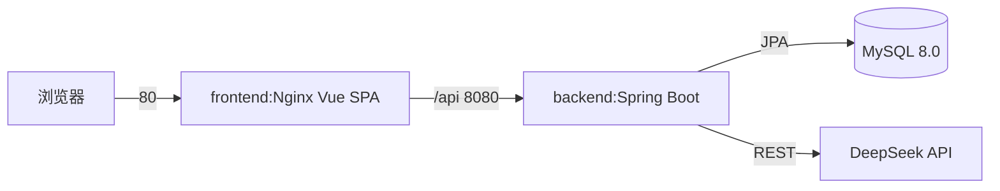
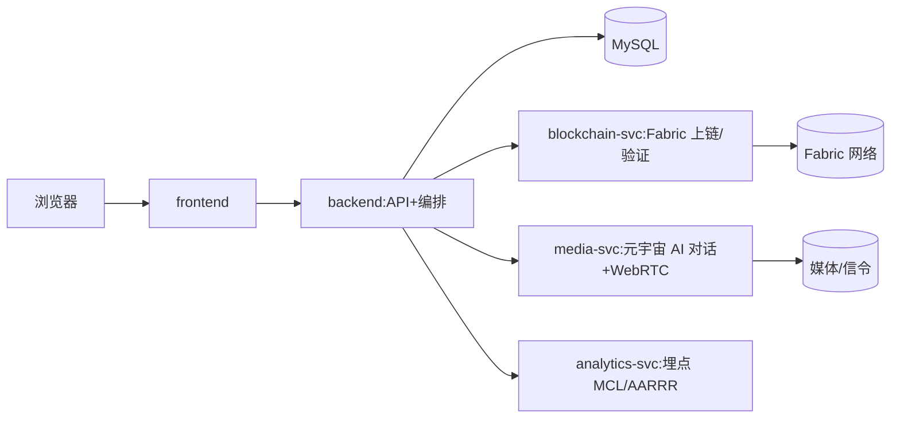

# 芒得很职 目标架构 SDD（口径 A · 骨架草稿 v0.1）

> 文档定位：**后续重构的单一事实源（SSOT）**
> 版本：v0.1（骨架草稿；待 PM 路线图/PRD 与 QA/SRE 安全核验合成后升 v1.0）
> 架构师：高见远（software-architect）
> 策略锚点：**保留芒得很职（vocational），不走 408 重写**（team-lead 已确认）。
> 依据：复用现有 Spring Boot+Vue 脚手架 + 已实现的 A(测评)+C(证书/模拟链) 模块 + Metaverse 原型；产品战略见 `deliverables/product-strategy/roadmap-update-mangdehenzhi-2026-07-17.md`（A 智能测评 / B 元宇宙实训 / C 区块链证书 三支柱 + 北极星 MCL）。
> 分期：Lite（软件杯 ~20 天，闭环跑通+安全基线+稳定演示）/ Real（大创 2026.11，Fabric 上链 + 元宇宙 AI 实时互动 + 自适应路径/督学 + 埋点 MCL/AARRR）。

---

## 0. 范围与本次边界

本版为**骨架草稿**，只定：
- 目标模块划分与依赖方向（复用现有 A/C/Metaverse，标注 Real 新增）
- 服务/部署拓扑（Lite 复用现有 compose；Real 增 blockchain/media/analytics 服务）
- 关键接口与数据模型（现有实体/服务复用 + Real 占位接口）
- 分期映射（Lite / Real）
- 安全基线（**核对 SRE 已修复项后**列剩余缺口）

**不在本版铺满**：完整 API 契约、Fabric 链码设计、WebRTC 信令细节、自适应路径算法、埋点 event schema。这些待 PM/QA/工程师输入合成后升 v1.0。
**原 408 SDD（`docs/sdd-blueprint-skeleton.md`）已作废。**

---

## 1. 设计原则

1. **复用不重写**：脚手架（Spring Boot+Vue+MySQL+Docker）与 A/C/Metaverse 模块直接复用，不在 Lite 阶段推倒重来。
2. **闭环优先（Lite）**：现有 `登录→测评→AI 报告→课程→证书(模拟链)` 闭环跑通、稳、可演示；不新增重依赖。
3. **真版叠加不回改**：Real 在 Lite 闭环上**增量**加 Fabric / 元宇宙 AI / 自适应路径+督学 / 埋点，而非重写 Lite 已上线部分。
4. **安全内建 + 不重复**：以当前代码复核 SRE 修复项，仅补剩余缺口，不重复已完成项。

---

## 2. 目标模块图（口径 A）



> Lite 阶段仅启用 AUTH/A/AI/COURSE/C/META + MySQL + DeepSeek；BC/MAI/ADP/ANA 与 FABRIC/MEDIA 为 Real 占位，不进入 Lite 构建。

---

## 3. 服务 / 部署拓扑

### 3.1 Lite 拓扑（~20 天，复用现有 compose）

复用 `docker-compose.yml`：`db` + `backend` + `frontend` 三服务。**不新增重依赖**（无 Fabric/向量库/独立媒体服务）。

### 3.2 Real 拓扑（大创，分期叠加，本版仅占位）

新增 `blockchain-svc`、`media-svc`、`analytics-svc` 三服务；Lite 的 `CertificationService`(模拟) / `MetaverseService`(原型) 替换为指向这些服务的真实实现。

---

## 4. 关键接口与数据模型

### 4.1 现有实体（复用，勿重建）
`User` / `Course` / `Assessment` / `AssessmentResult` / `Certification` / `MetaverseSession`（见 `backend/.../entity/`，与 `sql/init.sql` 一致，prod `ddl-auto: validate` 下实体改动须同步 init.sql）。

### 4.2 现有服务（复用）
`AuthService`、`AssessmentService`(A)、`AIService`+`DeepSeekService`(AI 报告，带无 Key 降级)、`CourseService`、`CertificationService`(C 模拟链)、`MetaverseService`(B 原型)。

### 4.3 Real 新增（占位接口，待 v1.0 细化）
```java
// C 模块：模拟链 → 真实 Fabric
public interface BlockchainService {
    String storeOnChain(Certification cert);      // 真实上链，返回可验证 txId/证据
    boolean verifyOnChain(String certHash);       // 真实链上核验，非硬编码 true
}
// B 模块：元宇宙 AI 实时互动
public interface MetaverseAIService {
    DialogueSession startSession(Long userId, SceneType type);  // 对话后端
    SignalingTicket issueWebRTCTicket(Long sessionId);          // WebRTC 媒体信令
}
// 自适应学习路径 + 督学
public interface AdaptivePathEngine {
    LearningPath recompute(Long userId);          // 学情画像→动态路径
}
public interface SupervisionService {
    void nudge(Long userId, NudgeReason reason);  // 轻量督学提醒（提完课率）
}
// 埋点（北极星 MCL = 测评+实训+证书闭环完成数）
public interface InstrumentationService {
    void track(Event event);                      // MCL / AARRR 事件
}
```

---

## 5. 分期映射速查

| 能力（对应路线图 A/B/C） | Lite（~20 天） | Real（大创，叠加） |
|---|---|---|
| A 智能测评 | 现有闭环（DeepSeek 报告）跑通 | A 深化 + 能力画像 |
| B 元宇宙实训 | Metaverse 原型保留（Three.js） | AI 角色实时互动（WebRTC+对话后端） |
| C 区块链证书 | 模拟链（现状，演示用） | **真实 Fabric 上链 + 可验证证据** |
| 自适应路径 + 督学 | — | AdaptivePathEngine + SupervisionService（提完课率 +15~20pp） |
| 埋点 MCL/AARRR | — | InstrumentationService（P0：测评完成/闭环完成先于一切） |
| 安全基线 | 复核 SRE 修复 + 补 Lite 缺口 | 补环境项（TLS/令牌存储/依赖） |
| 部署 | 3 服务（复用 compose） | + blockchain-svc + media-svc + analytics-svc |

---

## 6. 安全基线（核对 SRE 修复后）

> 来源：`deliverables/SECURITY_AUDIT_REPORT.md`（26 项，原 D 级）。team-lead 确认 **SRE 已编译修复 F-001/002/003/004/005/006/007/010/012/018**。

**代码 spot-check 已确认落地（v0.1 核验）**
| 项 | 证据 |
|---|---|
| F-001 提交 JWT 密钥 | `application.yml` 占位密钥 `${JWT_SECRET:local-dev-only...}` + `application-prod.yml` `jwt.secret: ${JWT_SECRET}`（无默认，缺失即启动失败） |
| F-002 默认口令 | `DataInitializer` `@Profile("!prod")` 仅非生产种子 + `passwordEncoder.encode`（BCrypt） |
| F-003 匿名建课 | `SecurityConfig` `POST/PUT/DELETE /api/courses/**` 需 `ADMIN/TEACHER` |
| F-004 方法级鉴权 | `SecurityConfig @EnableMethodSecurity` + `JwtAuthenticationFilter` 填充 `ROLE_<role>` authorities |
| F-012 Swagger 暴露 | `SwaggerConfig` `@Profile("!prod")`（prod 关闭） |

**SRE 已修复（team-lead 确认，建议 Lite 前做一次安全复测确认）**：F-001, F-002, F-003, F-004, F-005(IDOR 测评), F-006(IDOR PII), F-007(端口暴露), F-010(限流 XFF), F-012, F-018(弱库口令)。

**仍待补缺口（不在 SRE 列表，按优先级）**
- **Lite 建议补**：F-017 出站 DeepSeek 无超时（稳定性，易修）；F-009 CORS 收敛可信源；F-023 证书验证端点公开；F-024/025 小瑕疵（输入回显 / GET 改状态）。
- **环境 / Real**：F-008 传输层 TLS（演示&生产必需）；F-014 JWT 存 localStorage→HttpOnly Cookie；F-015 axios 升级；F-019 CI SHA 锁定 + Trivy；F-016 提示注入结构化；F-011 H2 dev 收敛 + frameOptions 局部。
- **设计性（非"修"，而是架构替换）**：F-013 区块链模拟恒返回 `verified:true` → 由 Real 的 **Fabric 真实链上证据** 解决（C 模块真版目标）。

> ⚠️ 勿重复 SRE 已完成项；v1.0 前附 QA/SRE 安全复测报告。

---

## 7. 待补输入（吸收后升 v1.0）

- ✅ **工程师 A/B 代码核实已收**：但口径 A 下**保留** A/C/Metaverse，原"删除 blockchain/metaverse"计划**作废**；`index/`、`JSMO-PAGE/`、`marl_ecdsa_dashboard.html`、`后台管理系统/` 仍为运行外产物，建议迁 `research/` 降噪（非必须）。
- **PM 路线图/PRD 合成**：A/B/C 闭环范围与 2026 Q3/Q4 里程碑（A 深化+个性化路径+轻量督学 / B 立项 / C 合规备案+MVP）。
- **QA/SRE 安全复测报告**：确认 F-001..018 现状，避免重复。
- **工程师 P0/P1 改造工作量**：针对 Real 新增（Fabric / 元宇宙 AI / 自适应路径 / 埋点）。

> 本骨架即「芒得很职 口径 A」起点：复用脚手架与 A/C/Metaverse，Lite 闭环跑通+安全，Real 增量叠 Fabric/AI/自适应/埋点。原 408 SDD 作废。
